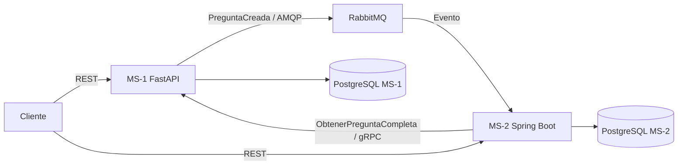

# Taller 2 — Implementación de Microservicios con DDD

Sistema de gestión de preguntas para las Pruebas Saber Pro. La solución está
compuesta por dos microservicios con API REST, bases de datos independientes y
comunicación mediante eventos y gRPC.

## Tecnologías y dependencias

| Componente | Tecnologías y dependencias principales |
|---|---|
| MS-1 Banco de Preguntas | Python 3.12, FastAPI, Uvicorn, Pydantic, SQLAlchemy, PostgreSQL (`psycopg2`), RabbitMQ (`pika`), gRPC |
| MS-2 Ciclo de Vida y Revisión | **Java 21 y Spring Boot 4.1.1**, Spring Web MVC, JDBC, AMQP, validación, Flyway, PostgreSQL, gRPC y Maven Wrapper |
| Infraestructura | Docker, Docker Compose, PostgreSQL 16 y RabbitMQ 3.13 |
| Pruebas | `unittest` para MS-1; Maven y JUnit/Spring Boot Test para MS-2; Postman para el flujo REST integrado |

Las dependencias de MS-1 están declaradas en
[`ms-banco-preguntas/requirements.txt`](./ms-banco-preguntas/requirements.txt).
Las de MS-2 están en
[`ms-ciclo-vida/microservicios/demo/pom.xml`](./ms-ciclo-vida/microservicios/demo/pom.xml).
No es necesario instalar Python, Java ni Maven para levantar el sistema
integrado: Docker Compose construye y ejecuta los servicios.

## Arquitectura y flujo

Diagrama editable de arquitectura para abrir con diagrams.net (draw.io):
[`arquitectura_microservicios.drawio`](./arquitectura_microservicios.drawio).
Representa REST, gRPC, RabbitMQ/AMQP y las dos bases PostgreSQL. Esta
implementación utiliza RabbitMQ; no utiliza Kafka.



1. El cliente crea una pregunta en MS-1.
2. MS-1 la guarda en PostgreSQL y publica el evento `PreguntaCreada` en
   RabbitMQ.
3. MS-2 consume el evento y crea una revisión en estado `PENDIENTE`.
4. El cliente asigna un revisor, inicia la revisión y registra una observación.
   Para evaluar, MS-2 consulta los datos de la pregunta a MS-1 mediante gRPC.
5. El cliente reanuda la revisión y registra un dictamen.

Cada microservicio mantiene su propia base de datos. Las migraciones de MS-2 se
ejecutan automáticamente mediante Flyway cuando inicia la aplicación.

## Requisitos para ejecutar

- Docker Desktop iniciado y Docker Compose v2.
- PowerShell en Windows para los comandos de esta guía.
- Postman para ejecutar las pruebas manuales (opcional).
- Para ejecutar las pruebas locales: Python 3.11 o 3.12 y Java 21.

Si tienes RabbitMQ instalado localmente como servicio, detenlo antes de iniciar
Docker: el contenedor usa el puerto `5672`.

## Iniciar el proyecto con Docker Compose

Abre PowerShell en la raíz del repositorio, `implementacion_micros`.

### Construir y levantar todos los servicios

```powershell
docker compose up -d --build
```

La primera compilación descarga las imágenes base y compila MS-1 y MS-2; puede
tardar unos minutos. Comprueba el estado:

```powershell
docker compose ps
```

Direcciones locales:

| Servicio | Dirección |
|---|---|
| MS-1 REST | <http://localhost:8001> |
| Swagger UI de MS-1 | <http://localhost:8001/docs> |
| MS-2 REST (Spring Boot) | <http://localhost:8002> |
| RabbitMQ Management | <http://localhost:15672> (`guest` / `guest`) |
| gRPC de MS-1 | `localhost:50051` |

Si algún contenedor no inicia, revisa sus logs:

```powershell
docker compose logs -f ms-ciclo-vida
docker compose logs -f ms-banco-preguntas
docker compose logs -f rabbitmq
```

Para detener los contenedores sin borrar los datos:

```powershell
docker compose down
```

Para reiniciar desde cero y eliminar también las bases de datos guardadas en
volúmenes, ejecuta `down -v`. **Esta acción borra los datos persistidos.**

### Dockerfile de MS-2

El Dockerfile de MS-2 está en
[`ms-ciclo-vida/Dockerfile`](./ms-ciclo-vida/Dockerfile). Compose lo usa para
construir MS-2 con Java 21 y Spring Boot. Para construir solo esa imagen desde
la raíz:

```powershell
docker build -f ms-ciclo-vida\Dockerfile -t ms-ciclo-vida .
```

La imagen por sí sola no inicia las bases, RabbitMQ ni MS-1; para correr el
sistema integrado usa docker Compose.

## Ejecutar pruebas automatizadas

### MS-1 — Python

Desde la raíz del repositorio:

```powershell
Push-Location ms-banco-preguntas
py -3.12 -m venv .venv
.\.venv\Scripts\Activate.ps1
python -m pip install -r requirements.txt
python -m unittest discover -s tests -v
deactivate
Pop-Location
```

Si usas Python 3.11, reemplaza `py -3.12` por `py -3.11`.

### MS-2 — Java y Spring Boot

El Maven Wrapper está incluido en el proyecto; no hace falta instalar Maven
globalmente. Desde la raíz:

```powershell
Push-Location ms-ciclo-vida\microservicios\demo
.\mvnw.cmd clean test
Pop-Location
```

## Pruebas de integración con Postman

La colección lista para importar es
[`ms-ciclo-vida/microservicios/postman_collection.json`](./ms-ciclo-vida/microservicios/postman_collection.json).
En Postman selecciona **Import → Files** y abre ese archivo. La colección usa
las variables `ms1` (`http://localhost:8001`), `ms2`
(`http://localhost:8002`), `preguntaId`, `revisionId` y `revisorId` (`202`).

Primero levanta Docker Compose y espera a que MS-1, MS-2 y RabbitMQ estén
iniciados. Después envía las solicitudes **manualmente y en orden**; las
variables de IDs se guardan automáticamente entre solicitudes.

| # | Solicitud | Qué hace y qué comprueba la prueba Postman |
|---:|---|---|
| 1 | `POST {{ms1}}/preguntas` | Crea una pregunta. Verifica `201` y estado `PENDIENTE_REVISION`; guarda `preguntaId`. |
| 2 | `GET {{ms2}}/api/revisiones/pregunta/{{preguntaId}}` | Consulta la revisión creada por el consumidor RabbitMQ. Verifica `200` y estado `PENDIENTE`; guarda `revisionId`. |
| 3 | `POST {{ms2}}/api/revisiones/asignar` | Asigna `revisorId` a la pregunta. Verifica `201` y que la revisión y el evaluador coincidan con las variables. |
| 4 | `POST {{ms2}}/api/revisiones/{{revisionId}}/iniciar` | Inicia la revisión. Verifica `200` y estado `EN_REVISION`. |
| 5 | `POST {{ms2}}/api/revisiones/evaluar` | Registra la observación de ejemplo y consulta MS-1 por gRPC. Verifica `200`. |
| 6 | `POST {{ms2}}/api/revisiones/{{revisionId}}/iniciar` | Reanuda la revisión después de la observación. Verifica `200` y estado `EN_REVISION`. |
| 7 | `POST {{ms2}}/api/revisiones/dictamen` | Emite el dictamen de ejemplo `APROBADA`. Verifica `200` y resultado `APROBADA`. |
| 8 | `GET {{ms1}}/preguntas/{{preguntaId}}` | Verifica el cierre del ciclo en MS-1. Verifica `200` y que el estado cambió a `APROBADA` tras recibir el evento de RabbitMQ. |

**Importante:** la entrega de `PreguntaCreada` es asíncrona. Después de la
solicitud 1, espera unos segundos antes de la solicitud 2. Si devuelve `404`,
vuelve a enviar únicamente la solicitud 2 hasta que la revisión aparezca; no
vuelvas a crear la pregunta. Si reenvías la solicitud 1, MS-1 creará otra
pregunta y actualizará `preguntaId`.

Los scripts de la pestaña **Scripts → Post-response** (o **Tests**, según la
versión de Postman) ya están incluidos en la colección: valida códigos HTTP y
estados, y guarda los IDs necesarios. Al terminar, las siete pruebas deben
aparecer aprobadas en los resultados de Postman.

Para consultar los endpoints de MS-1 interactivamente, abre
<http://localhost:8001/docs>. El detalle de rutas y reglas de transición de
MS-2 está en el
[README del microservicio de ciclo de vida](./ms-ciclo-vida/microservicios/README.md).
