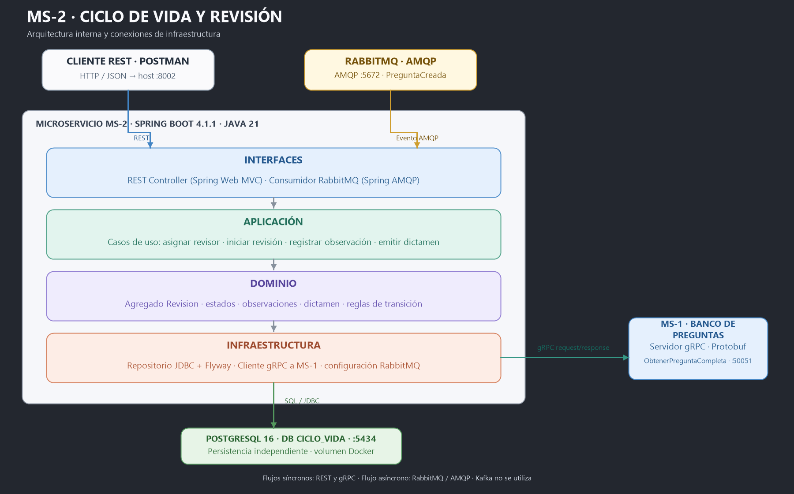
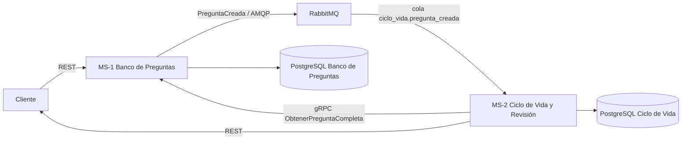
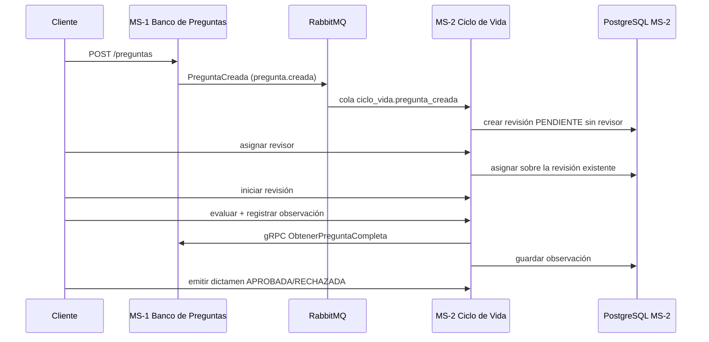

# MS-2 — Ciclo de Vida y Revisión

Microservicio Spring Boot con arquitectura por capas/DDD. El agregado `Revision`
mantiene el flujo de estados y persiste sus datos en una base PostgreSQL propia.

## Arquitectura de infraestructura

El diagrama muestra las capas de MS-2 y su integración con el cliente REST,
RabbitMQ, el servidor gRPC de MS-1 y PostgreSQL:



## Arranque

Desde la raíz del repositorio:

```bash
docker compose -f ms-ciclo-vida/microservicios/docker-compose.yaml up -d --build
docker compose -f ms-ciclo-vida/microservicios/docker-compose.yaml ps
```

El Compose levanta MS-1 REST, su servidor gRPC, MS-2, RabbitMQ y ambas bases.
MS-2 espera a PostgreSQL y RabbitMQ; las migraciones Flyway se ejecutan al
arrancar la aplicación. El gRPC de MS-1 escucha en `localhost:50051`.

Para ejecutar las pruebas de MS-2 localmente:

```bash
cd ms-ciclo-vida/microservicios/demo
./mvnw clean test
```

En Windows se puede usar `mvnw.cmd clean test`.

## Flujo principal





El consumidor verifica el evento `PreguntaCreada` v1, su timestamp ISO-8601,
que el identificador sea numérico y que su estado sea `PENDIENTE_REVISION`.
La creación es idempotente por `pregunta_id`; una pregunta solo puede tener una
revisión. Los mensajes inválidos se rechazan y se enrutan a
`ciclo_vida.pregunta_creada.dlq`. Los fallos transitorios se reintentan tres
veces.

La asignación requiere que el evento haya creado primero la revisión; asignar
una pregunta desconocida devuelve 404. El evaluador permanece sin asignar hasta
ese momento y la fecha se guarda al asignarlo.

## API de MS-2

Base: `http://localhost:8002/api/revisiones`

| Método | Ruta | Uso |
|---|---|---|
| `GET` | `/pregunta/{idPregunta}` | Consultar la revisión creada desde el evento |
| `POST` | `/asignar` | Asignar revisor a esa revisión |
| `POST` | `/{idRevision}/iniciar` | Iniciar o reanudar la revisión |
| `POST` | `/evaluar` | Consultar pregunta completa por gRPC y guardar observación |
| `POST` | `/dictamen` | Aprobar o rechazar y guardar el dictamen |

Ejemplo de asignación:

```json
{
  "idSolicitud": 41,
  "idEvaluador": 202,
  "fechaAsignacion": "2026-10-02"
}
```

Ejemplo de evaluación (la revisión debe estar en `EN_REVISION`):

```json
{
  "idRevision": "UUID-devuelto-por-la-consulta",
  "codigo": "OBS-1",
  "descripcion": "Aclarar el enunciado",
  "categoria": "FORMA"
}
```

La respuesta de `/evaluar` contiene la revisión actualizada y el detalle
obtenido del servidor gRPC. Si MS-1 no responde dentro del plazo, la API devuelve
503 sin guardar la observación; si la pregunta no existe, devuelve 404.

El dictamen acepta `resultado` `APROBADA` o `RECHAZADA` y requiere que la
revisión esté en `EN_REVISION`; después de observaciones, se debe iniciar de
nuevo antes de emitirlo.

## Estado del roadmap de MS-2

| Fase | Entregable de Ciclo de Vida y Revisión | Estado |
|---|---|---|
| 0 | Consume los contratos compartidos de gRPC y eventos | Completa |
| 1 | Estructura DDD, cliente gRPC, consumer RabbitMQ y PostgreSQL independiente | Completa |
| 2 | Agregado `Revision`, observaciones, invariantes de transición y repositorio | Completa |
| 3 | Asignación, consulta, inicio, evaluación y dictamen por REST | Completa |
| 4 | Cliente gRPC generado desde el `.proto` y probado | Completa |
| 5 | Consumer idempotente de `PreguntaCreada`, reintentos y dead-letter queue | Completa |
| 6 | Stack Docker integrado y flujo de aprobación ejecutado de extremo a extremo | Completa |
| 7 | README, diagramas, pruebas y colección Postman | Completa |

La publicación de `PreguntaAprobada`/`PreguntaRechazada` es el bonus opcional
del roadmap; no se implementó porque MS-1 todavía no consume esos eventos.

## Contratos y pruebas manuales

- gRPC: [`../../contracts/pregunta.proto`](../../contracts/pregunta.proto)
- Evento: [`../../contracts/eventos.md`](../../contracts/eventos.md)
- Colección Postman: [`postman_collection.json`](./postman_collection.json)

La colección sigue el flujo y guarda automáticamente `preguntaId` y
`revisionId`; además valida los códigos HTTP y los estados esperados en cada
paso. Envía las solicitudes manualmente en orden. El evento es asíncrono: si la
consulta inicial responde 404, espera unos segundos y repítela.

Prueba gRPC aislada con `grpcurl`:

```bash
grpcurl -plaintext -d '{"pregunta_id":"41"}' localhost:50051 bancopreguntas.PreguntaService/ObtenerPreguntaCompleta
```
